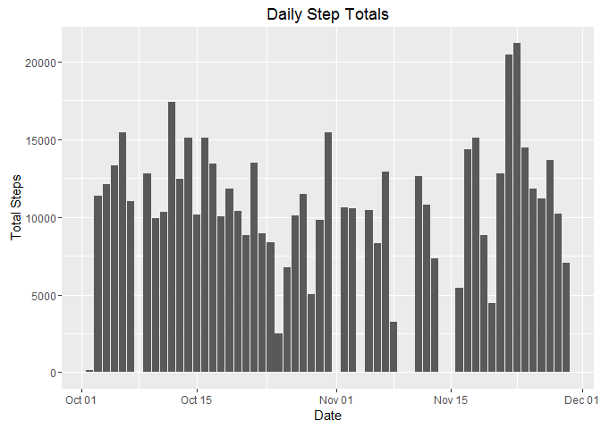
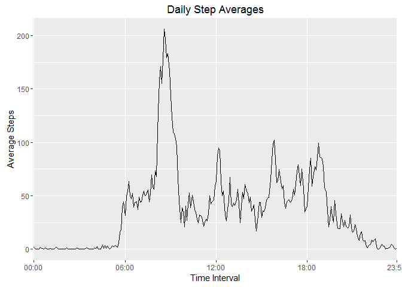
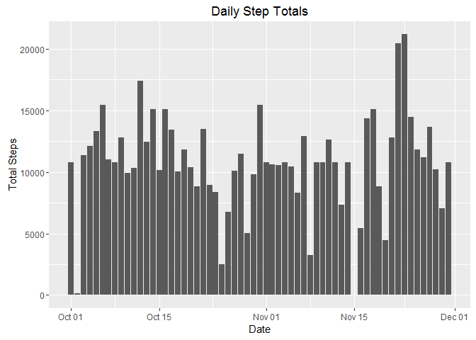
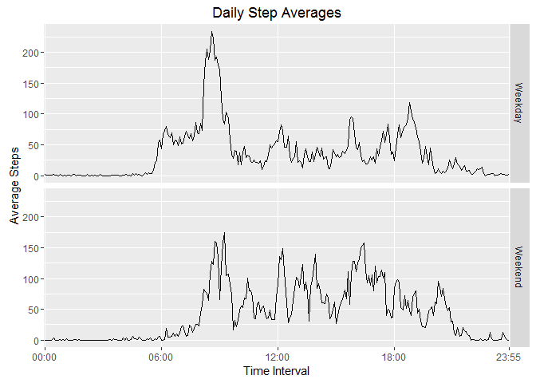

# Reproducible Research - R Markdown Project 1: Step Count Activity Data Project
GC  
October 3, 2016  


#### Download the Data
Data source: https://d396qusza40orc.cloudfront.net/repdata%2Fdata%2Factivity.zip

Download the data file, in this case it was saved to a folder called "05-Reproducible Research/Project 1".
This can be done in code with "download.file(url, destfile)" where 'url' is the data source and 'destfile' is the local saved file.

#### Question 1. Code for reading in the dataset and/or processing the data
#### Set Working Directory and Load Data

```r
knitr::opts_chunk$set(root.dir = './05-Reproducible Research/Project 1')
zipfile <- "ActivityData.zip"
datafile <- "activity.csv"
rawdata <- read.table(unz(zipfile, datafile), header=TRUE, quote="\"", sep=",")
```

#### Question 2. Histogram of the total number of steps taken each day

```r
library(dplyr)
library(ggplot2)
dates <- group_by(rawdata, date)
TotalStepsDF <- summarize(dates, TotalSteps = sum(steps))
ggplot(aes(x = as.Date(date), y = TotalSteps), data = TotalStepsDF, format="%b %d") + geom_bar(stat="identity") + ggtitle("Daily Step Totals") + xlab("Date") + ylab("Total Steps")
```

<!-- -->

#### Question 3. Mean and median number of steps taken each day


The **mean** number of steps taken each day during the two months under consideration is **10766.19**, and the **median** number of steps is **10765**.

#### Question 4. Time series plot of the average number of steps taken

```r
library(lubridate)
library(stringr)
intervals <- group_by(rawdata, interval)
AvgStepsIntervalDF <- summarize(intervals, AvgSteps = mean(steps, na.rm = TRUE))

#Convert the time intervals to time format
timepadded <- str_pad(AvgStepsIntervalDF$interval, 4, pad="0")
AvgStepsIntervalDF$intervalTime <- substr(as.POSIXct(sprintf(timepadded), format='%H%M'), 12, 16)

#Construct the plot
ggplot(AvgStepsIntervalDF, aes(x = intervalTime, y = AvgSteps, group = 1)) + geom_line(stat="identity") + ggtitle("Daily Step Averages") + xlab("Time Interval") + ylab("Average Steps") + scale_x_discrete(breaks=c("00:00", "06:00", "12:00", "18:00", "23:55"))
```

<!-- -->

#### Question 5. The 5-minute interval that, on average, contains the maximum number of steps


On average, the maximum number of steps was contained in the interval starting at **835**, which, for this period averaged **206.2** steps.

#### Question 6. Code to describe and show a strategy for imputing missing data

The total number of rows with NA values in the 'steps' column is **2304**. The following code generates a new data set based on the original raw data, then iterates through to find each NA value and replace it with the corresponding value from the averaged data previously computed.


```r
newData <- rawdata
for(i in seq_len(nrow(newData)) ) {  
        if (is.na(newData$steps[i])) { 
                intervalN <- newData$interval[i]
                AvgIndex <- which(AvgStepsIntervalDF$interval == intervalN)
                newData$steps[i] <- AvgStepsIntervalDF$AvgSteps[AvgIndex] 
        }
}
```


#### Question 7. Histogram of the total number of steps taken each day after missing values are imputed

```r
newdates <- group_by(newData, date)
TotalStepsDF <- summarize(newdates, TotalSteps = sum(steps))
ggplot(aes(x = as.Date(date), y = TotalSteps), data = TotalStepsDF, format="%b %d") + geom_bar(stat="identity") + ggtitle("Daily Step Totals") + xlab("Date") + ylab("Total Steps")
```

<!-- -->

#### Question 8. Panel plot comparing the average number of steps taken per 5-minute interval across weekdays and weekends


```r
# Assign part of week
rawdata$weekpart <- ifelse(wday(rawdata$date)==1|wday(rawdata$date)==7,"Weekend","Weekday")

# Group and summarize by part of week
library(lubridate)
library(stringr)
newintervals <- group_by(rawdata, weekpart, interval)
AvgStepsNewIntervalDF <- summarize(newintervals, AvgSteps = mean(steps, na.rm = TRUE))

# Format the time code
timepadded <- str_pad(AvgStepsNewIntervalDF$interval, 4, pad="0")
AvgStepsNewIntervalDF$intervalTime <- substr(as.POSIXct(sprintf(timepadded), format='%H%M'), 12, 16)

# Plot the average steps by part of week
ggplot(AvgStepsNewIntervalDF, aes(x = intervalTime, y = AvgSteps, group = 1)) + facet_grid(weekpart ~ .) + geom_line(stat="identity") + ggtitle("Daily Step Averages") + xlab("Time Interval") + ylab("Average Steps") + scale_x_discrete(breaks=c("00:00", "06:00", "12:00", "18:00", "23:55"))
```

<!-- -->
